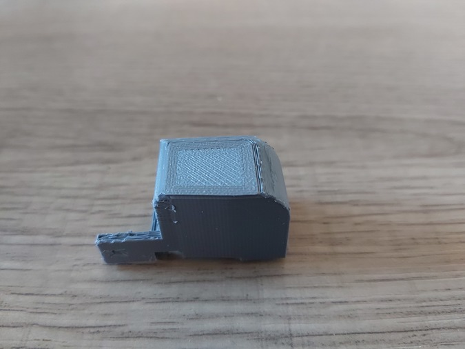

# Progress

# Test 1:

The narrow corner is too big to fit the hole in the controller. Will narrow it down.

# Test 2:

Didn't quite get the top smooth but I did manage to fit the button in the controller.

The clips to attach the spring base are too flimsy at 0.5mm length, I will increase it to 1.5mm and increase the size of the hole that keeps the metal in place.

# Test 3:

I increased the depth of the clips. However they snapped when trying to connect the metal rail. Unfortunately I forgot to make the cutout go all the way through but I think that had no effect. I'll try making the gap larger to make it easier to slide in the bar, and hopefully less likely to snap.

# Test 4:

The changes to the clips fixed the issue. Now it fits into the slot but when the plastic lid is closed properly it gets stuck. For the next test I will remove one millimeter of depth.